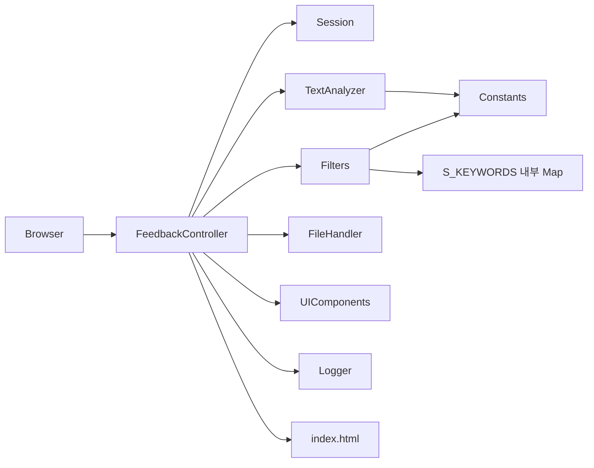

# FeedBackAnalyzer — 코드베이스 분석

> **근거**: `docs/00_prd.md`, `project_purpose.md`, `README.md`, `src/` 전체  
> **작성일**: 2026-05-21  
> **목적**: 전체 구조·문제점·미션 안내 (SPEC 단계 산출물)

---

## 1. 분석 개요

| 항목 | 내용 |
|------|------|
| 프로젝트명 | 리팩토링 챌린지: Feedback Analyzer |
| PRD 기준 | `docs/00_prd.md` v2.0 |
| 기술 | Java 17, Spring Boot 3.5.3, Thymeleaf, OpenCSV |
| 패키지 | 단일 `com.example.demo` (레이어 미분리) |
| 실행 | `mvn spring-boot:run` → port **8080** |

### 1.1. PRD 대비 현황 요약

| PRD 영역 | 현황 |
|----------|------|
| FR-01~08 Baseline | **구현됨** (품질 이슈 다수) |
| FR-09~11 GREEN | **미완** |
| FR-12~16 REFACTORING | **미착수** |
| FR-17~18 New_Feature | **미착수** |
| FR-19~21 RED | **미착수** (`contextLoads`만 존재) |

---

## 2. 전체 디렉터리 구조

```text
FeedBackAnalyzer_01/
├── pom.xml
├── README.md
├── project_purpose.md
├── 작업규칙.TXT
├── docs/
│   ├── 00_prd.md
│   ├── 01_analysis.md          ← 본 문서
│   ├── 02_work_scenario.md
│   └── 03_work_guide.md
├── src/main/java/com/example/demo/
│   ├── DemoApplication.java
│   ├── FeedbackController.java
│   ├── Feedback.java
│   ├── TextAnalyzer.java
│   ├── Filters.java
│   ├── FileHandler.java
│   ├── Constants.java
│   ├── Session.java
│   ├── UIComponents.java
│   └── Logger.java
├── src/main/resources/
│   ├── application.properties
│   └── templates/index.html
└── src/test/java/com/example/demo/
    └── DemoApplicationTests.java
```

### 2.1. 요청 처리 흐름



**특징**

- **God Controller**: `FeedbackController`가 라우팅·CSV·분석·다운로드·상태 혼합
- **이중 감정 규칙**: `Constants` + `Filters.S_KEYWORDS` + `TextAnalyzer` 기본값 중립
- **전역 상태**: `Session` static, `fil_data`, `globalSent`/`globalKw`

---

## 3. 클래스·파일별 분석

| 파일 | 역할 | PRD 매핑 | 문제 |
|------|------|----------|------|
| `DemoApplication` | 앱 기동 | — | 정상 |
| `FeedbackController` | HTTP·CSV·Model | FR-01~08 | God Object, `C:\tmp`, download 헤더 오류 |
| `Feedback` | 도메인 | FR-04~05 | `sentiment`/`category` 미사용 |
| `TextAnalyzer` | `sent()`, `kw()` | FR-04~05 | 중립 키워드 미검사, `fil`/`kw` 네이밍 |
| `Filters` | `fil()` | FR-06, FR-09 | `S_KEYWORDS` 중복·TextAnalyzer 불일치 |
| `Constants` | 키워드 하드코딩 | FR-05, FR-13 | 중복 리스트, Shotgun Surgery |
| `Session` | static 피드백 목록 | — | HTTP 세션 아님, FR-12 대상 |
| `FileHandler` | save 스텁 | FR-03 | 미연동, Lava Flow |
| `UIComponents` | 카테고리 5종 | FR-06 | Constants와 이중 정의 |
| `Logger` | 콘솔 출력 | FR-11 | UI 미연동, static/@Service 혼재 |
| `index.html` | 단일 UI | FR-07, FR-10 | feedbacks 미렌더, 로그 패널 없음 |
| `DemoApplicationTests` | 테스트 | FR-19~21 | `contextLoads()`만 |

---

## 4. HTTP API 상세

| Method | Path | 동작 | PRD | 갭 |
|--------|------|------|-----|-----|
| GET | `/` | Session 초기화, categories | FR-01 | — |
| POST | `/analyze` | text 추가 → sent/kw | FR-02,04,05 | multiline 보완 필요 |
| POST | `/upload` | CSV → line[0] | FR-03 | 통계 미표시, `C:\tmp` |
| POST | `/filter` | fil → fil_data | FR-06 | **중립 버그** |
| GET | `/download` | fil_data CSV | FR-08 | 헤더 오류, fil_data 비어있을 수 있음 |

---

## 5. 문제점 분석

### 5.1. PRD Must Fix (GREEN — FR-09~11)

| ID | 문제 | 위치 | PRD | 상세 |
|----|------|------|-----|------|
| **P0-1** | 중립 필터 불일치 | `TextAnalyzer` vs `Filters` | FR-09 | `sent()`는 긍/부만 검사 후 나머지 중립. `fil()`은 `S_KEYWORDS` 중립 키워드 검사. `괜찮`이 긍정·중립 중복 → 긍정 우선 |
| **P0-2** | 로그 UI 없음 | `Logger`, `index.html` | FR-11 | System.out만, level UI 제어 없음 |
| **P1-1** | Multiline 보완 | `index.html`, `/analyze` | FR-10 | textarea 존재하나 표시·처리 일관성 검증 필요 |

### 5.2. Baseline 버그 (GREEN 권장)

| ID | 문제 | 위치 | PRD |
|----|------|------|-----|
| P1-2 | Content-Disposition 오류 | `downloadFile` L178 | FR-08 |
| P1-3 | fil_data 미갱신 시 빈 다운로드 | `fil_data` | FR-08 |
| P1-4 | 업로드 후 분석 통계 없음 | `/upload` | FR-03,07 |
| P1-5 | `C:\tmp\` 하드코딩 | `/upload` L102 | NFR-03 |
| P1-6 | 피드백 목록 UI 미표시 | `index.html` | FR-07 |

### 5.3. 의도적 코드 스멜 (`project_purpose.md` §4)

| 스멜/안티패턴 | 코드 증거 |
|---------------|-----------|
| God Function/Controller | `FeedbackController` 192줄, CSV 파싱 내장 |
| 중복 코드 | 감정 판별 3곳 (`Constants`, `S_KEYWORDS`, TextAnalyzer default) |
| 부적절한 네이밍 | `fil`, `sent`, `kw`, `fil_data`, `res`, `wr` |
| 전역 변수 | `Session` static, `globalSent`, `fil_data` |
| 매직/하드코딩 | 키워드 리스트, `C:\tmp` |
| 테스트 미비 | FR-20 미달 |
| Lava Flow | `FileHandler`, `fileHandler` 주입만 되고 미사용 |
| Shotgun Surgery | 카테고리 추가 시 4~5 파일 수정 |
| Feature Envy | `Filters`가 `CATEGORY_KEYWORDS` 구조에 강결합 |

### 5.4. 문서·리소스 갭

| 항목 | README/PRD | 실제 |
|------|------------|------|
| `test_feedbacks.csv` | README 구조 | **미존재** |
| `test_feedback_trend.csv` | PRD FR-17 | **미존재** |
| README 구조명 | `filters`, `Constant` | `Filters`, `Constants` |
| `.gitignore` | — | `target/` 추적 가능 |

---

## 6. 미션 안내 (학습 로드맵)

`project_purpose.md` §6.1 + `작업규칙.TXT` + `00_prd.md` §9 통합.

| 단계 | 브랜치 | 시간 | 미션 | PRD | 우선 파일 |
|------|--------|------|------|-----|-----------|
| **1** | SPEC | 1h | 구조·미션 분석, 요구 정의 | — | `docs/*` |
| **2** | RED | 2h | JUnit5, 커버리지 **90%** | FR-19~21 | `src/test/**`, `TextAnalyzer`, `Filters`, `FileHandler` |
| **3** | GREEN | 1.5h | 중립 필터, multiline, 로그 UI | FR-09~11 | `Filters`, `Logger`, `index.html` |
| **4** | REFACTORING | 1h | 네이밍·상수·전역 | FR-12~13 | `Constants`, `Session`, 전 클래스 |
| **5** | REFACTORING | 1.5h | 긴 함수·중복 제거 | FR-14 | `TextAnalyzer`, `Filters` |
| **6** | REFACTORING | 1h | Controller SRP | FR-15~16 | `FeedbackController` → Service |
| **7** | New_Feature | 3h | Trend + File DB | FR-17~18 | 신규 Service, CSV, persistence |
| **8** | — | 2h | 팀 리뷰·발표 | — | `report/` 회고 |

### 6.1. 단계별 공식 Agent 프롬프트

| 단계 | 프롬프트 |
|------|----------|
| SPEC | `@Codebase 전체 구조·미션 안내 분석해줘` |
| RED | `@DemoApplicationTests.java 커버리지 90%… TextAnalyzer·Filters·FileHandler TC` |
| GREEN | `@Filters.java '중립' 필터 버그` / `@index.html multiline` / `@Logger.java 로그 level UI` |
| REFACTORING-4 | `@Constants.java @TextAnalyzer.java 매직넘버·네이밍` |
| REFACTORING-5 | `@TextAnalyzer.java 20줄 이상 추출·중복 통합` |
| REFACTORING-6 | `@FeedbackController.java Service 분리` |
| New_Feature | Trend CSV + File DB |

### 6.2. 목표 아키텍처 (REFACTORING 이후)

```text
com.example.demo/
├── controller/   FeedbackController (얇게)
├── service/      Analysis, Filter, File, Log
├── model/        Feedback, Sentiment, Category
├── config/       KeywordConfig
└── repository/   File DB (New_Feature)
```

### 6.3. 즉시 우선순위

1. **P0** FR-09: 감정 규칙 단일화 (`TextAnalyzer` ↔ `Filters`)
2. **P0** FR-11: 로그 Model + UI
3. **P1** FR-10, FR-08, FR-03 업로드·다운로드
4. **P2** FR-19~21 RED + JaCoCo
5. **P3** FR-12~18 구조·신규 기능

---

## 7. PRD 기능 추적 매트릭스

| PRD ID | 설명 | 구현 | 테스트 | 비고 |
|--------|------|------|--------|------|
| FR-01 | 대시보드 | ✅ | — | |
| FR-02 | 텍스트 입력 | ✅ | ❌ | |
| FR-03 | CSV 업로드 | △ | ❌ | 경로·통계 갭 |
| FR-04 | 감정 분석 | △ | ❌ | 중립 규칙 |
| FR-05 | 카테고리 | ✅ | ❌ | |
| FR-06 | 필터 | △ | ❌ | 중립 버그 |
| FR-07 | 시각화 | △ | ❌ | 목록 미표시 |
| FR-08 | 다운로드 | △ | ❌ | 헤더·데이터 |
| FR-09~11 | GREEN | ❌ | ❌ | |
| FR-12~16 | REFACTOR | ❌ | — | |
| FR-17~18 | Feature | ❌ | ❌ | CSV 없음 |
| FR-19~21 | RED | ❌ | △ | contextLoads만 |

범례: ✅ 양호 · △ 부분/버그 · ❌ 미구현

---

## 8. 빌드·의존성

- `mvn test`: `DemoApplicationTests.contextLoads()`만 실행 → **통과**
- JaCoCo: **미설정** → FR-20 위해 `pom.xml` 추가 필요
- `FileHandler` @Autowired: Controller에 주입되나 **호출 없음**

---

## 9. 참고 문서

| 문서 | 용도 |
|------|------|
| `docs/00_prd.md` | 요구사항 공식 기준 |
| `project_purpose.md` | 학습 목표·의도적 스멜 |
| `README.md` | 설치·사용·CSV |
| `docs/02_work_scenario.md` | 단계별 실행 시나리오 |
| `docs/03_work_guide.md` | 작업·Git·산출물 안내 |
