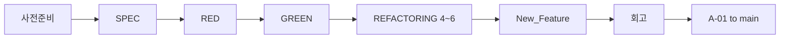

# Feedback Analyzer — 작업 시나리오

> **근거**: `00_prd.md`, `01_analysis.md`, `project_purpose.md`, `README.md`, `작업규칙.TXT`  
> **작성일**: 2026-05-21

---

## 1. 시나리오 목적

단계별로 **무엇을·어떤 브랜치에서·어떤 순서로·어떤 산출물과 함께** 수행하는지 실행 가능한 시나리오로 정의한다.

---

## 2. 전체 타임라인



| 단계 | 브랜치 | PR Base | 예상 |
|------|--------|---------|------|
| 0 | — | — | 30m |
| 1 | SPEC | A-01 | 1h |
| 2 | RED | A-01 | 2h |
| 3 | GREEN | A-01 | 1.5h |
| 4~6 | REFACTORING | A-01 | 3.5h |
| 7 | New_Feature | A-01 | 3h |
| 8 | — | main | 2h |

---

## 3. 시나리오 0 — 사전 준비

### 3.1. 환경

```bash
git clone https://github.com/antihu99/FeedBackAnalyzer_01.git
cd FeedBackAnalyzer_01
mvn spring-boot:run
```

### 3.2. 문서 읽기 순서

1. `README.md` — 실행·CSV
2. `project_purpose.md` — 학습·스멜
3. `docs/00_prd.md` — 요구사항
4. `docs/01_analysis.md` — 갭·미션
5. `docs/03_work_guide.md` — Git·산출물

### 3.3. 폴더 생성

```text
docs/   report/   prompting/
```

### 3.4. Baseline E2E 체크 (`01_analysis.md` §5)

| # | 확인 |
|---|------|
| 1 | `http://localhost:8080` 접속 |
| 2 | 텍스트 입력 → 통계 |
| 3 | CSV 업로드 (`text` 컬럼) |
| 4 | 감정=중립 필터 (**버그 재현 기록**) |
| 5 | 다운로드 |

---

## 4. 시나리오 1 — SPEC

| 항목 | 내용 |
|------|------|
| 브랜치 | `SPEC` (from `A-01`) |
| PRD | 문서 확정 |
| 프롬프트 | `@Codebase 전체 구조·미션 안내 분석해줘` |

### 실행 순서

| 순서 | 작업 | 산출물 |
|------|------|--------|
| 1 | `git checkout -b SPEC` | — |
| 2 | PRD 작성 | `docs/00_prd.md` |
| 3 | src 분석 | `docs/01_analysis.md` |
| 4 | 시나리오·안내 | `docs/02_work_scenario.md`, `docs/03_work_guide.md` |
| 5 | 대화 저장 | `prompting/00_SPEC_prompt.md` |
| 6 | 커밋 (class 제외) | `git add docs/ prompting/` |
| 7 | PR | SPEC → A-01 |

### DoD

- [ ] `00_prd.md`, `01_analysis.md` 존재
- [ ] PRD 추적 매트릭스와 src 갭 일치
- [ ] PR 머지 또는 리뷰 중

---

## 5. 시나리오 2 — RED

| 항목 | 내용 |
|------|------|
| 브랜치 | `RED` |
| PRD | FR-19~21 |
| 분석 근거 | `01_analysis.md` §6.2 — P0 중립 버그 TC 포함 |

### 실행 순서

| 순서 | 작업 |
|------|------|
| 1 | `git checkout A-01 && git pull && git checkout -b RED` |
| 2 | `pom.xml` JaCoCo 플러그인 추가 |
| 3 | `TextAnalyzerTest`, `FiltersTest`, `FileHandlerTest` 작성 |
| 4 | 중립 필터 TC — **의도적 실패 허용** (GREEN 전) |
| 5 | `mvn test jacoco:report` |
| 6 | `report/01_RED_coverage_report.md` |
| 7 | PR RED → A-01 |

### DoD

- [ ] 커버리지 ≥ 90%
- [ ] 클래스별 TC 존재
- [ ] 리포트에 미통과 TC 목록 (GREEN 입력)

---

## 6. 시나리오 3 — GREEN

| 항목 | 내용 |
|------|------|
| 브랜치 | `GREEN` |
| PRD | FR-09~11 (+ `01_analysis.md` P1 권장) |

### 실행 순서

| 순서 | 작업 | 프롬프트/파일 |
|------|------|----------------|
| 1 | 감정 규칙 통합 | `Filters`, `TextAnalyzer`, 공통 모듈 |
| 2 | 중립 필터 수정 | `@Filters.java '중립' 필터 버그` |
| 3 | Multiline | `@index.html multiline` |
| 4 | 로그 UI | `@Logger.java level UI` |
| 5 | (권장) download, upload 경로 | `FeedbackController` |
| 6 | `mvn test` 전체 Green | — |
| 7 | E2E 체크리스트 재실행 | §3.4 |
| 8 | `report/02_GREEN_bugfix_report.md` | |
| 9 | PR GREEN → A-01 | |

### DoD

- [ ] FR-09~11 AC 충족
- [ ] RED TC 전부 통과
- [ ] 커버리지 90% 유지

---

## 7. 시나리오 4~6 — REFACTORING

**브랜치**: `REFACTORING` (서브 단계별 커밋 또는 1 PR)

### 7.1. 4단계 — 네이밍·상수 (1h)

- **PCTF**: `pctf/03_REFACTORING_step4_naming_PCTF_prompt.md` §★ PROMPT
- 프롬프트: `@Constants.java @TextAnalyzer.java 매직넘버·네이밍`
- `fil`→`filterFeedbacks`, `sent`→`analyzeSentiment`, `kw`→`analyzeKeywords`
- DoD: FR-12~13, TC 유지
- **Git**: `REFACTOR step4: domain naming and constants (FR-12, FR-13)` → `push origin REFACTORING`

### 7.2. 5단계 — 중복·긴 함수 (1.5h)

- **PCTF**: `pctf/04_REFACTORING_step5_sentiment_SRP_PCTF_prompt.md` §★ PROMPT
- 프롬프트: `@TextAnalyzer.java 20줄 이상 추출·중복 통합`
- 감정 로직 **단일 클래스** (FR-14)
- DoD: FR-14, SRP 제안서 `docs/09_REFACTOR_SRP_proposal.md` 또는 `report/` 부록
- **Git**: `REFACTOR step5: SentimentClassifier SRP… (FR-14)` → push

### 7.3. 6단계 — Controller SRP (1h)

- **PCTF**: `pctf/05_REFACTORING_step6_controller_SRP_PCTF_prompt.md` §★ PROMPT
- 프롬프트: `@FeedbackController.java Service 분리`
- 패키지: `controller`, `service`, `model`, `config`
- DoD: FR-15~16, URL 불변
- **Git**: `REFACTOR step6: Controller SRP…` + `report/03_REFACTORING_report.md` → push

### 공통 마무리

- `report/03_REFACTORING_report.md`
- PR REFACTORING → A-01

---

## 8. 시나리오 7 — New_Feature

| # | 기능 | 시나리오 |
|---|------|----------|
| ① | Trend | `test_feedback_trend.csv` → `src/main/resources/` → 차트 UI |
| ② | File DB | 키워드 CRUD → 재기동 후 유지 |

| 순서 | 작업 |
|------|------|
| 1 | `git checkout -b New_Feature` |
| 2 | 샘플 CSV·스키마 문서 |
| 3 | Feature TC |
| 4 | 구현 |
| 5 | `report/04_New_Feature_report.md` |
| 6 | PR → A-01 |

### DoD

- [ ] FR-17~18 AC
- [ ] FR-19~21 유지

---

## 9. 시나리오 8 — 회고·릴리스

### 9.1. 회고 (`project_purpose.md` §6.1-8)

`report/05_retrospective.md`:

1. 목표 vs 달성도  
2. AI 활용·한계  
3. TC가 개선에 미친 영향  
4. 클린코드·리팩토링 소감  

### 9.2. 최종 PR

```text
Head: A-01  →  Base: main
제목: Release — Feedback Analyzer
```

- 기능 브랜치 **삭제하지 않음**

---

## 10. PR·브랜치 매트릭스

| # | Head | Base | 포함 PRD |
|---|------|------|----------|
| 1 | SPEC | A-01 | 문서 |
| 2 | RED | A-01 | FR-19~21 |
| 3 | GREEN | A-01 | FR-09~11 |
| 4 | REFACTORING | A-01 | FR-12~16 |
| 5 | New_Feature | A-01 | FR-17~18 |
| 6 | A-01 | main | 전체 |

---

## 11. 리스크 시나리오

| 상황 | 대응 |
|------|------|
| 중립 TC 계속 실패 | SentimentService 단일화 후 Filters/TextAnalyzer 위임 |
| 커버리지 90% 미달 | Controller·Session 테스트 보강 |
| CSV 없음 | `src/main/resources/test_feedbacks.csv` 추가 |
| PR 충돌 | A-01 최신 pull 후 rebase |

---

## 12. 관련 문서

| 문서 | 경로 |
|------|------|
| PRD | `docs/00_prd.md` |
| 분석 | `docs/01_analysis.md` |
| 작업 안내 | `docs/03_work_guide.md` |
