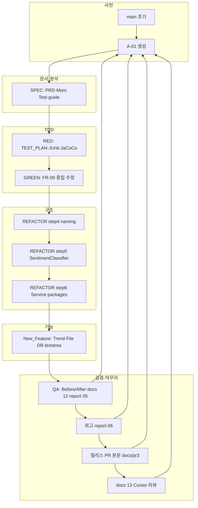

# 작업 시나리오 대비 진행 검증 및 업무 흐름 정리

| 항목 | 내용 |
|------|------|
| 문서 ID | DOC-FLOW-001 |
| 작성일 | 2026-05-22 |
| 검증 기준 | `작업규칙.TXT`, `project_purpose.md` §6.1, `docs/02_work_scenario.md`, `docs/03_work_guide.md` |
| 실증 근거 | `prompting/*`, `GIT_prompt.md`, `report/*`, `docs/*`, Git `A-01` @ `50968bb` |
| 목적 | 시나리오대로 수행되었는지 **합격/부분/미수행** 판정 및 **실제 업무 흐름** 기록 |

---

## 1. 검증 요약

| 구분 | 계획 단계 수 | ✅ 완료 | 🟡 부분 | ⬜ 미수행 |
|------|-------------|--------|--------|----------|
| 작업규칙 1~8단계 (브랜치) | 8 | 6 | 1 | 1 |
| `02_work_scenario` 시나리오 0~9 | 10 | 7 | 2 | 1 |
| `project_purpose` §6.1 학습 가이드 | 8 | 6 | 1 | 1 |
| prompting 단계 기록 | 6 Agent 파일 | 6 | 0 | 0 |

**종합 판정**: 핵심 트랙(SPEC → RED → GREEN → REFACTORING → New_Feature → QA 문서 → 회고)은 **시나리오 의도에 부합**하게 진행됨.  
**잔여**: `A-01`→`main` 릴리스 머지, FR-11 Logger UI, 일부 PR·`gh` 자동화.

---

## 2. 기준 문서 ↔ 실제 매핑

| 기준 문서 | 정의한 내용 | 실제 반영 위치 |
|-----------|-------------|----------------|
| `작업규칙.TXT` | 1~8단계 브랜치·프롬프트 | Git 브랜치·커밋 메시지·PCTF |
| `project_purpose.md` §6.1 | 학습 시간·8주제 가이드 | 단계별 report·회고 `06` |
| `docs/02_work_scenario.md` | 실행 순서·DoD·PR 매트릭스 | 본 문서 §4·§5 |
| `docs/03_work_guide.md` | 산출물 명명·Git·품질 게이트 | `docs/00`~`13`, `report/00`~`06` |
| `prompting/00`~`05` | Agent·User·Git 이력 | 대화·명령 재현 |

---

## 3. 단계별 시나리오 검증 (작업규칙 1~8단계)

### 3.1 검증 표

| 작업규칙 단계 | 브랜치 | 시나리오 프롬프트·DoD | 실제 수행 | 산출물·근거 | 판정 |
|---------------|--------|----------------------|-----------|-------------|------|
| **1** 프로젝트 개요·준비 | `SPEC` | `@Codebase` 분석, PRD, 시나리오·안내 | PRD·analysis·guide·Mom Test·`.cursorrules`·`tdd_rules.yaml` | `docs/00`~`06`, `report/00`, `prompting/00_SPEC` | ✅ |
| **2** 테스트 구조 개선 | `RED` | JUnit 5, 90% 커버, 클래스별 TC | 34 tests, JaCoCo 90.9%, TC-NEUTRAL **의도 실패** | `docs/07`, `report/01`, `prompting/01_RED` | ✅ |
| **3** 버그 수정 3건 | `GREEN` | 중립·multiline·Logger UI | **FR-09만** GREEN PCTF 범위로 완료; multiline은 **New_Feature** UI 커밋에서 반영 | `report/02`, `docs/08`, `6e88371` | 🟡 |
| **4** 네이밍·매직넘버 | `REFACTORING` | Constants·TextAnalyzer 개선 | step4: rename, enum, dedupe | `2d81f59`, `pctf/03`, `03_REFACTORING` | ✅ |
| **5** 긴 함수·중복 | `REFACTORING` | TextAnalyzer 추출·SRP | step5: `SentimentClassifier` | `2d81f59`, `docs/09`, `pctf/04` | ✅ |
| **6** SRP Controller | `REFACTORING` | Service 분리·HTTP only | step6: `FeedbackService`, 패키지 4종 | `0c23667`, `pctf/05`, `report/03` | ✅ |
| **7** 추가 기능 | `new_feature` | Trend CSV·File DB | step1~5 commit+push, 41 tests | `report/04`, `docs/10`·`11`, `prompting/04` | ✅ |
| **8** REVIEW | `QA` | 전후 비교 Markdown | QA step2~5, Before `6e88371` | `docs/12`, `report/05`, `prompting/05_QA` | ✅ |

### 3.2 GREEN 3건 상세 (작업규칙 3단계 vs 실제)

| # | 작업규칙 요청 | FR | 실제 | 판정 |
|---|---------------|-----|------|------|
| ① | `@Filters.java` 중립 필터 버그 | FR-09 | `87136db`, TC-NEUTRAL PASS | ✅ |
| ② | `@index.html` multiline | FR-10 | `852fc4c` (FEATURE step4) `textarea` 적용 — **GREEN 단계가 아님** | 🟡 |
| ③ | `@Logger.java` 로그 레벨 UI | FR-11 | `index.html`에 level UI **없음** (`report/02` §6 범위 외) | ⬜ |

### 3.3 시나리오 문서와 작업규칙 차이

| 항목 | `02_work_scenario.md` | `작업규칙.TXT` (갱신) | 실제 |
|------|----------------------|----------------------|------|
| 8단계 명칭 | §9 회고·릴리스 | §8 **REVIEW (QA)** + 회고는 9단계 성격 | **QA** 브랜치·`report/05` 후 `06` 회고 |
| 회고 파일명 | `report/05_retrospective.md` | — | **`report/06_retrospective.md`** (05는 REVIEW) |
| QA 브랜치 | 명시 없음 (§8 전) | `QA` 명시 | `QA` 생성·push·A-01 머지 |

→ 시나리오 문서 일부 번호·단계명은 **작업 중 갱신**되었고, 실제 Git·산출물은 **갱신된 작업규칙**을 따름.

---

## 4. `docs/02_work_scenario.md` 시나리오 0~9 검증

| 시나리오 | DoD 핵심 | 검증 결과 | 근거 |
|----------|----------|-----------|------|
| **0** 사전 준비 | E2E baseline 기록 | 🟡 | `01_analysis` §5 버그 기술; formal E2E 체크리스트 문서화는 `11`·수동 |
| **1** SPEC | PRD·analysis·PR | ✅ | `00`~`03`, PR #1, `9b03001` |
| **2** RED | ≥90%, TC, report | ✅ | `07`, `01`, `e07ca6b`, JaCoCo 90.9% |
| **3** GREEN | FR-09~11, RED TC Green | 🟡 | FR-09 ✅; FR-10 지연 완료; FR-11 ⬜ |
| **4~6** REFACTORING | FR-12~16, URL 불변 | ✅ | step4~6 커밋, `03`, 5 path MockMvc |
| **7** New_Feature | FR-17~18, step별 push | ✅ | `291bd85`~`b7e4d54`, `docs/11` |
| **8** 회고·릴리스 | retrospective, A-01→main | 🟡 | `06` ✅; **main 머지·PR #3 편집** ⬜ (`docs/pr3_body_*`) |
| **(추가)** QA REVIEW | — (작업규칙 §8) | ✅ | `12`, `05`, `13` |

---

## 5. 진행된 업무 흐름 (시간·브랜치 순)

### 5.1 전체 흐름도



### 5.2 단계별 상세 흐름 (실행 순)

| 순서 | 일자(대략) | 브랜치 | 주요 작업 | Git·문서 키포인트 | prompting |
|------|------------|--------|-----------|-------------------|-----------|
| 0 | 2026-05-21 | — | 저장소·`A-01`·폴더 규칙 | User #1 | `GIT_prompt` |
| 1 | 2026-05-21 | `SPEC` | Codebase 분석→PRD→시나리오·안내·Mom Test | `9b03001`, `docs/00`~`06` | `00_SPEC`, User #2~#17 |
| 2 | 2026-05-21~22 | `RED` | TEST_PLAN, JUnit, JaCoCo, TC-NEUTRAL FAIL | `e07ca6b`, `07`, `01` | `01_RED`, User #18~#32 |
| 3 | 2026-05-22 | `RED`→`A-01` | RED 머지 | `git merge RED` | `GIT_prompt` |
| 4 | 2026-05-22 | `GREEN` | FR-09 Filters 규칙 통일 | `87136db`~`6e88371` | `02_GREEN`, User #33~#40 |
| 5 | 2026-05-22 | `GREEN`→`A-01` | GREEN fast-forward | `A-01` = `6e88371` | PR #4 MERGED |
| 6 | 2026-05-22 | `REFACTORING` | step4~6 + report 03 | `29821a6`~`3324267` | `03_REFACTORING`, User #41~#43 |
| 7 | 2026-05-22 | `new_feature` | step1~5 Trend·File DB·UI | `291bd85`~`bc1724f` | `04_New_Feature`, User #44~#50 |
| 8 | 2026-05-22 | `new_feature`→`A-01` | Fast-forward 머지 | `bc1724f` | User #51~#53 |
| 9 | 2026-05-22 | `QA` | REVIEW outline·report 05 | `0283d46`, `71f241f` | `05_QA`, User #57 |
| 10 | 2026-05-22 | `QA` | 회고 06·prompting | `afcbc53` | User #58 |
| 11 | 2026-05-22 | `QA`→`A-01` | QA 문서 머지 | `afcbc53` on A-01 | — |
| 12 | 2026-05-22 | `A-01` | 릴리스 PR 본문·Cursor 리뷰 | `8cdb538`, `50968bb` | `docs/13`, `pr3_body_*` |

### 5.3 Git 브랜치·PR 흐름 (PART 6)

```text
main (3a526ea — 초기 과제)
 └── A-01 (50968bb — 통합 HEAD)
      ├── SPEC     → PR #1 → A-01  [✅ 문서]
      ├── RED      → PR #2 → A-01  [✅ 머지]
      ├── GREEN    → PR #4 → A-01  [✅ MERGED]
      ├── REFACTORING → PR #5 → A-01  [🟡 GitHub OPEN 여부 확인]
      ├── new_feature → (fast-forward A-01)  [✅ bc1724f]
      └── QA       → (fast-forward A-01)       [✅ afcbc53]

최종: A-01 → main  [⬜ PR #3 갱신·머지 대기, gh auth 필요]
```

**브랜치 삭제**: 시나리오 §9.2 “기능 브랜치 삭제하지 않음” → `origin`에 SPEC/RED/GREEN/REFACTORING/new_feature/QA **유지** ✅

---

## 6. prompting 폴더 대비 Agent 작업 추적

| prompting 파일 | 대응 작업규칙·시나리오 | User_prompt 구간 | 완료 여부 |
|----------------|----------------------|------------------|-----------|
| `00_SPEC_prompt.md` | 1단계·Phase 1~6 문서 | #1~#17 | ✅ |
| `01_RED_prompt.md` | 2단계·시나리오 2 | #18~#32 | ✅ |
| `02_GREEN_prompt.md` | 3단계·시나리오 3 | #33~#40 | ✅ (FR-09 중심) |
| `03_REFACTORING_prompt.md` | 4~6단계·시나리오 4~6 | #41~#43 | ✅ |
| `04_New_Feature_prompt.md` | 7단계·시나리오 7 | #44~#50 | ✅ |
| `05_QA_REVIEW_prompt.md` | 8단계 REVIEW·회고 | #57~#58 | ✅ |
| `User_prompt.md` | 전체 사용자 입력 표 | #1~#58 | ✅ |
| `GIT_prompt.md` | commit·push·merge 명령 | — | ✅ (A-01 HEAD 일부 구버전 문구 있음 → `50968bb` 기준 갱신 권장) |

**PCTF 사용 여부**: `pctf/00`~`07` 모두 존재하며, RED·GREEN·REFACTOR step4~6·New_Feature·QA에서 **§★ PROMPT** 실행 기록이 prompting·report와 **일치** ✅

---

## 7. 산출물 체크리스트 (`03_work_guide` 기준)

### 7.1 docs/

| 파일 | 시나리오·guide 기대 | 존재 |
|------|---------------------|------|
| `00_prd.md` | SPEC | ✅ |
| `01_analysis.md` | SPEC | ✅ |
| `02_work_scenario.md` | SPEC | ✅ |
| `03_work_guide.md` | SPEC | ✅ |
| `04_mom_test.md` | Phase 1 | ✅ |
| `05_code_smell.md` | Phase 1 | ✅ |
| `06_todo_list.md` | Phase 6 | ✅ |
| `07_RED_test_plan.md` | RED | ✅ |
| `08_GREEN_test_results.md` | GREEN | ✅ |
| `09_REFACTOR_SRP_proposal.md` | REFACTOR step5 | ✅ |
| `10_feature_schema.md` | New_Feature | ✅ |
| `11_New_Feature_test_results.md` | New_Feature | ✅ |
| `12_QA_review_outline.md` | QA (작업규칙 §8) | ✅ |
| `13_cursor_ai_code_review_report.md` | (추가 REVIEW 통합) | ✅ |
| `14_work_flow_verification.md` | **본 문서** | ✅ |
| `pr3_body_*.md` | 릴리스 PR | ✅ |

### 7.2 report/

| 파일 | 단계 | 존재 |
|------|------|------|
| `00_SPEC_phase_report.md` | SPEC | ✅ |
| `01_RED_coverage_report.md` | RED | ✅ |
| `02_GREEN_bugfix_report.md` | GREEN | ✅ |
| `03_REFACTORING_report.md` | REFACTORING | ✅ |
| `04_New_Feature_report.md` | New_Feature | ✅ |
| `05_REVIEW_refactoring_report.md` | QA | ✅ |
| `06_retrospective.md` | 회고 | ✅ |

### 7.3 품질 게이트 (최종 A-01)

| 게이트 | `03_work_guide`·`tdd_rules` | 실측 |
|--------|----------------------------|------|
| `mvn clean test` | 0 failures | 41 / 0 / 0 ✅ |
| JaCoCo line | ≥ 90% | ~90.4% ✅ |
| HTTP 5 path | contract_immutable | WebTest ✅ |
| Dual-Track RED→GREEN | TC-NEUTRAL RED→PASS | ✅ |
| REFACTOR contract | URL·CSV 불변 | ✅ |

---

## 8. `project_purpose.md` §6.1 학습 가이드 대비

| # | 가이드라인 (§6.1) | 대응 작업규칙·브랜치 | 판정 |
|---|-------------------|---------------------|------|
| 1 | 프로젝트 개요·준비 (1h) | SPEC | ✅ |
| 2 | 테스트·coverage 90% (2h) | RED | ✅ |
| 3 | 오류 개선·log·multiline·중립 (1.5h) | GREEN + (multiline→NF) | 🟡 |
| 4 | 네이밍·매직넘버·전역 (1h) | REFACTOR step4 | ✅ |
| 5 | 긴 함수·중복 (1.5h) | REFACTOR step5 | ✅ |
| 6 | 리팩토링 1건 추가 (1h) | REFACTOR step6 SRP | ✅ |
| 7 | Trend·File DB (3h) | New_Feature | ✅ |
| 8 | 팀 리뷰·발표 (2h) | QA·`06` 회고 | 🟡 (문서 완료, 발표 일정 별도) |

---

## 9. 미수행·권장 후속 조치

| 우선순위 | 항목 | 시나리오 근거 | 권장 조치 |
|----------|------|---------------|-----------|
| P0 | `A-01` → `main` 머지 | §9.2, PR #6 | `gh auth login` → `docs/pr3_body_release_body.md` |
| P1 | FR-11 Logger level UI | 작업규칙 3③, §6 GREEN | `Logger` + `index.html` PCTF 또는 GREEN 후속 |
| P2 | `02_work_scenario` §9.1 파일명 | `05_retrospective` 표기 | ✅ `06`으로 `02`·`03` 갱신 (2026-05-22) |
| P2 | `06_todo_list` 마일스톤 상태 | M0~M6 ⬜ | ✅ 본 검증 결과 반영 |
| P3 | `GIT_prompt` HEAD 문구 | 구버전 | ✅ `eee9f2b` 반영 |
| P3 | E2E §3.4 formal 기록 | 시나리오 0 | `docs/11` 확장 또는 E2E 시트 |

---

## 10. 결론

1. **시나리오 준수**: Dual-Track TDD(RED→GREEN), Refactoring(FR-12~16), New_Feature(FR-17~18), QA REVIEW는 **계획된 브랜치·PCTF·산출물 경로**대로 진행되었다.  
2. **업무 흐름**: `SPEC(문서)` → `RED(실패 TC)` → `GREEN(FR-09)` → `REFACTORING(3 step)` → `new_feature(5 step)` → `QA(문서 검증)` → `A-01 통합` → `릴리스 PR 준비` 순으로 **선형 통합**되었다.  
3. **예외**: FR-10은 GREEN이 아닌 **New_Feature UI**에서 완료; FR-11·`main` 릴리스는 **미완**.  
4. **추적성**: `User_prompt.md` 58건 + `prompting/00`~`05` + `GIT_prompt.md`로 **프롬프트→커밋→문서** 추적 가능.

---

## 부록 A — 작업규칙 ↔ 시나리오 ↔ prompting 빠른 참조

| 작업규칙 | `02_work_scenario` | PCTF | prompting |
|----------|-------------------|------|-----------|
| 1 SPEC | §4 | — | `00_SPEC` |
| 2 RED | §5 | `00`~`01` | `01_RED` |
| 3 GREEN | §6 | `02` | `02_GREEN` |
| 4~6 REFACTORING | §7 | `03`~`05` | `03_REFACTORING` |
| 7 New_Feature | §8 | `06` | `04_New_Feature` |
| 8 REVIEW | (§9+작업규칙) | `07` | `05_QA` |

## 부록 B — A-01 통합 커밋 타임라인 (요약)

```text
6e88371  GREEN 완료 (REFACTORING Before 기준선)
29821a6  PCTF 03~05
2d81f59  step4~5
0c23667  step6
bc1724f  New_Feature 머지
afcbc53  QA + 회고
8cdb538  릴리스 PR 본문
50968bb  docs/13 Cursor 리뷰
ad5678b  GIT_prompt 릴리스 명령
```

---

## 관련 문서

| 문서 | 용도 |
|------|------|
| `docs/02_work_scenario.md` | 원본 시나리오 |
| `docs/03_work_guide.md` | 규칙·인덱스 |
| `docs/13_cursor_ai_code_review_report.md` | Cursor AI 기술 리뷰 |
| `prompting/GIT_prompt.md` | Git 실명령 이력 |
| `report/06_retrospective.md` | 회고 4문항 |
