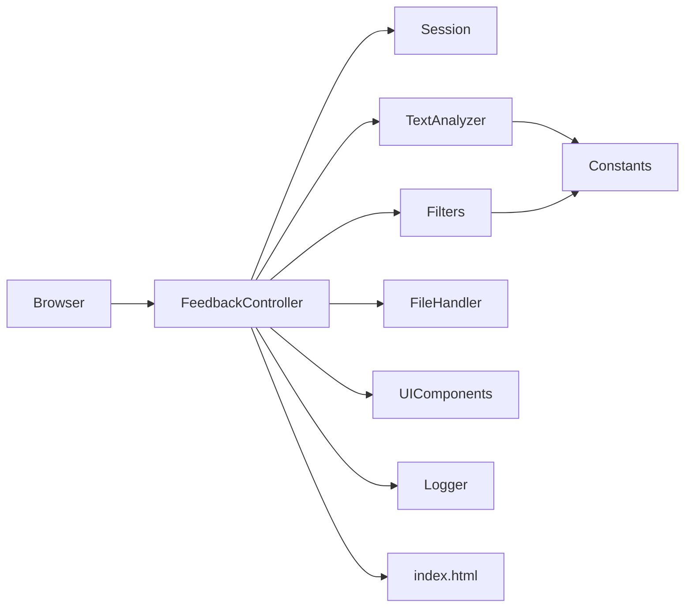

# FeedBackAnalyzer — 코드베이스 분석

> 분석 기준: `project_purpose.md`, `README.md`, `src/` 소스, `pom.xml`  
> 분석 일자: 2026-05-21

---

## 1. 프로젝트 개요

| 항목 | 내용 |
|------|------|
| 프로젝트명 | 리팩토링 챌린지: 고객 피드백 분석 시스템 (Feedback Analyzer) |
| 목적 | 의도적 코드 스멜이 포함된 Spring Boot 앱을 분석·리팩토링하며 클린 아키텍처 학습 |
| 기술 스택 | Java 17, Spring Boot 3.5.3, Thymeleaf, OpenCSV 5.11.2 |
| 실행 | `mvn spring-boot:run` → `http://localhost:8080` |
| 패키지 | 단일 패키지 `com.example.demo` (레이어 분리 없음) |

---

## 2. 전체 디렉터리 구조

```
FeedBackAnalyzer_01/
├── pom.xml                          # Maven 빌드·의존성
├── README.md                        # 사용자용 설치·실행 안내
├── project_purpose.md               # 학습 목표·미션·의도적 스멜 명세
├── docs/
│   └── analysis.md                  # 본 문서
├── src/
│   ├── main/
│   │   ├── java/com/example/demo/
│   │   │   ├── DemoApplication.java       # Spring Boot 진입점
│   │   │   ├── FeedbackController.java  # HTTP 요청·화면·비즈니스 혼합
│   │   │   ├── Feedback.java              # 피드백 도메인 (필드 미활용)
│   │   │   ├── TextAnalyzer.java          # 감정·키워드 집계
│   │   │   ├── Filters.java               # 감정·카테고리 필터
│   │   │   ├── FileHandler.java           # 파일 저장 (미사용·스텁)
│   │   │   ├── Constants.java             # 감정·카테고리 키워드 하드코딩
│   │   │   ├── Session.java               # 정적 전역 상태
│   │   │   ├── UIComponents.java          # UI 카테고리 목록
│   │   │   └── Logger.java                # 콘솔 로그 (Spring @Service)
│   │   └── resources/
│   │       ├── application.properties     # port 8080
│   │       └── templates/
│   │           └── index.html             # 단일 페이지 대시보드
│   └── test/java/com/example/demo/
│       └── DemoApplicationTests.java      # contextLoads만 존재
└── target/                          # 빌드 산출물 (Git 추적 중 — 문제)
```

### 2.1. 요청 흐름 (현재 아키텍처)



- **Controller 중심**: 분석·필터·업로드·다운로드가 `FeedbackController`에 집중.
- **상태**: HTTP 세션이 아닌 `Session` 클래스의 **static** 필드로 피드백 목록 유지.
- **분석 로직**: `TextAnalyzer` / `Filters`가 각각 다른 키워드 집합·규칙 사용 → 결과 불일치 가능.

---

## 3. 클래스별 역할

| 클래스 | Spring 역할 | 실제 책임 |
|--------|-------------|-----------|
| `DemoApplication` | `@SpringBootApplication` | 앱 기동 |
| `FeedbackController` | `@Controller` | 라우팅, Model 바인딩, CSV 파싱, 다운로드, 인스턴스 필드 `fil_data` |
| `Feedback` | (없음) | `text`만 사용; `sentiment`, `category` 필드는 미설정·미노출 |
| `TextAnalyzer` | `@Service` | `sent()`, `kw()` — 키워드 매칭 후 건수 Map 반환 |
| `Filters` | `@Service` | `fil()` — 감정·카테고리 필터 (별도 `S_KEYWORDS` 보유) |
| `Constants` | (없음) | 감정·5개 카테고리 키워드 정적 Map |
| `Session` | (없음) | `currentFeedbacks` 등 static 전역 상태 |
| `FileHandler` | `@Service` | `save`/`saveResult` — `System.out`만 출력, Controller 미연동 |
| `UIComponents` | `@Service` | 카테고리 문자열 배열 반환 |
| `Logger` | `@Service` | static 메서드로 `System.out/err` 출력 |
| `index.html` | Thymeleaf | 입력·업로드·필터·통계·다운로드 UI |

---

## 4. HTTP API / 화면 매핑

| 메서드 | 경로 | 처리 내용 |
|--------|------|-----------|
| GET | `/` | 세션 초기화, 피드백·카테고리 Model 전달 |
| POST | `/analyze` | 텍스트 추가 → 감정·키워드 집계 |
| POST | `/upload` | CSV 업로드 → 첫 행 스킵 후 `line[0]` 적재 |
| POST | `/filter` | 감정·키워드 필터 → `fil_data` 갱신 |
| GET | `/download` | `fil_data` 기준 CSV 다운로드 |

---

## 5. 확인된 문제점

### 5.1. 동작·버그 (미션 3단계와 직결)

| # | 문제 | 위치 | 설명 |
|---|------|------|------|
| 1 | **중립 필터 불일치** | `TextAnalyzer` vs `Filters` | `TextAnalyzer.sent()`는 긍정/부정만 검사 후 나머지를 무조건 **중립**으로 집계. `Filters.fil()`은 별도 `S_KEYWORDS`로 중립 키워드(예: `보통`, `무난`)를 검사. 동일 문장이 분석·필터에서 다른 감정으로 분류될 수 있음. |
| 2 | **키워드 중복·우선순위** | `Filters.S_KEYWORDS` | `괜찮`이 긍정·중립 양쪽에 존재. `if-else` 순서상 긍정이 우선되어 중립 필터 시 기대와 다른 결과 가능. |
| 3 | **다운로드 헤더 오류** | `FeedbackController.downloadFile` | `Content-Disposition` 값이 `attachment:filename=` 형태로 잘못됨. 표준은 `attachment; filename="..."`. |
| 4 | **다운로드 데이터 소스** | `fil_data` | 필터(`/filter`)를 거치지 않으면 `fil_data`가 비어 있어 빈 CSV 가능. 분석만 한 결과와 연동되지 않음. |
| 5 | **CSV 업로드 경로** | `FeedbackController.uploadFile` | `C:\\tmp\\` 하드코딩 — Windows 전용, 디렉터리 없으면 실패, Linux/CI 비호환. |
| 6 | **업로드 후 분석 누락** | `/upload` | 업로드 성공 시 `sentimentResults`/`keywordResults`를 Model에 넣지 않아 화면 통계 미표시. |
| 7 | **피드백 목록 미표시** | `index.html` | `feedbacks`, `filteredFeedbacks`를 템플릿에서 렌더링하지 않음. |
| 8 | **로그 UI 미구현** | `Logger`, `index.html` | 로그는 콘솔만 출력. 미션 요구: 페이지에서 level별(warning, error) 표시 제어 — **미구현**. |

### 5.2. 의도적 코드 스멜 (`project_purpose.md` §4)

| 스멜/안티패턴 | 코드에서의 예 |
|---------------|----------------|
| God Object / God Function | `FeedbackController`가 입력·분석·필터·다운로드·CSV 파싱 담당 |
| 전역 상태 | `Session` static, `TextAnalyzer.globalSent/globalKw`, `fil_data` |
| 중복 로직 | 감정 판별이 `TextAnalyzer`, `Filters.S_KEYWORDS`, `Constants.SENTIMENT_KEYWORDS`에 분산 |
| 부적절한 네이밍 | `fil`, `sent`, `kw`, `fil_data`, `res`, `wr`, `fn`, `CATS` |
| 매직 넘버/하드코딩 | 키워드 리스트·`C:\\tmp\\`·포트 등 |
| Lava Flow | `FileHandler` 스텁, `filterOptions`·`internalData` 일부 미사용 |
| Shotgun Surgery | 카테고리 추가 시 `Constants`, `UIComponents.CATS`, `Filters`, UI select 동시 수정 |
| 테스트 미비 | `DemoApplicationTests`에 `contextLoads()`만 — 커버리지 0%에 가까움 |

### 5.3. 설계·품질

- **레이어 부재**: `controller` / `service` / `model` / `repository` 패키지 없음.
- **DI 혼란**: `Logger`는 `@Service`이나 메서드는 전부 `static`; Controller는 인스턴스 주입 후 static 호출과 동일 효과.
- **타입 안전성**: `Session.updateInternalData`에서 raw cast `(List<Feedback>)`.
- **Feedback 모델**: 분석 후 `sentiment`/`category`를 객체에 저장하지 않아 도메인 모델이 형식적.
- **`.gitignore` 없음**: `target/` 클래스 파일이 Git에 추적됨 (현재 `git status`에 다수 표시).
- **샘플 데이터 부재**: README의 `test_feedbacks.csv`, 미션 7의 `test_feedback_trend.csv`가 저장소에 없음.

### 5.4. UI·문서 불일치

- README 구조 설명(`filters`, `session` 소문자 파일 등)과 실제 Java 클래스명·패키지 구조 불일치.
- `index.html`에 `textarea`가 있어 다중 줄 입력은 **부분 지원** — 미션의 “multi line”은 로그·표시·서버 처리 측면 추가 개선으로 해석 가능.
- Thymeleaf `#dates` 사용 — Spring Boot 3 / Thymeleaf 3에서는 `#temporals` 권장 (경고·호환 이슈 가능).

---

## 6. 미션 안내 (학습 로드맵)

`project_purpose.md` §6 기준. 예상 소요 **약 12시간** + 팀 리뷰 2시간.

| 단계 | 주제 | 예상 시간 | 상세 과제 |
|------|------|-----------|-----------|
| **1** | 프로젝트 개요·실습 준비 | 1h | 전체 단계 미션 안내 숙지, 본 분석 문서·`project_purpose.md` 정독 |
| **2** | 테스트 구조 개선 | 2h | `TextAnalyzer`, `Filters`, `FeedbackController` 등 단위·통합 테스트 추가, **커버리지 90% 이상** |
| **3** | 동작 오류 수정 | 1.5h | 로그를 페이지에 level별 표시(warning, error 등); 텍스트 **multi-line** 입력 보완; **중립 필터 오류** 수정 |
| **4** | 네이밍·상수·전역 변수 | 1h | `fil`/`sent`/`kw` 등 rename; `Constants` → enum/설정 클래스; `Session`/`fil_data` 상태 정리 |
| **5** | 긴 함수·중복 코드 | 1.5h | Controller·템플릿 분리; 감정 분석 로직 단일화; Extract Class/Function |
| **6** | 추가 리팩토링 1건 | 1h | 전략 패턴(감정 분석), 레이어드 패키지 구조 등 자유 선택 |
| **7** | 추가 요구사항 | 3h | **Trend 시각화** (`test_feedback_trend.csv`); 감정·필터 설정 **File DB**화 |
| **8** | 팀 리뷰·발표 | 2h | 상대 프로젝트 리뷰, 장단점 정리, 발표 |

### 6.1. 단계별 권장 착수 파일

| 단계 | 우선 수정 파일 |
|------|----------------|
| 2 | `src/test/java/**`, `TextAnalyzer`, `Filters` |
| 3 | `FeedbackController`, `Filters`, `Logger`, `index.html` |
| 4 | `Session`, `Constants`, `FeedbackController`, 전 클래스 |
| 5 | `FeedbackController`, `index.html`, `TextAnalyzer`, `Filters` |
| 7 | 신규 `Trend`/`Chart` 서비스, persistence 레이어, CSV 리소스 추가 |

### 6.2. 리팩토링 목표 아키텍처 (권장 방향)

```
src/main/java/com/example/demo/
├── controller/     FeedbackController (얇게)
├── service/        AnalysisService, FilterService, FileService
├── model/          Feedback, Sentiment, Category
├── config/         KeywordConfig 또는 enum
└── repository/     (7단계) File DB 접근
```

---

## 7. 의존성·빌드

```xml
<!-- pom.xml 핵심 -->
spring-boot-starter-web
spring-boot-starter-thymeleaf
spring-boot-starter-test (test)
opencsv 5.11.2
```

- `mvn test` — **성공** (단일 `contextLoads` 테스트만 실행).
- JaCoCo 등 커버리지 플러그인 **미설정** — 90% 목표 시 `pom.xml`에 플러그인 추가 필요.

---

## 8. 즉시 개선 우선순위 (요약)

1. **P0 — 동작**: 중립 필터·감정 분석 규칙 통합 (`TextAnalyzer` ↔ `Filters`).
2. **P0 — 동작**: `/download` 헤더·데이터 소스(`fil_data` vs 전체 피드백) 수정.
3. **P1 — 호환**: CSV 임시 경로를 `Files.createTempFile` 또는 `MultipartFile.getInputStream()`으로 변경.
4. **P1 — 미션**: 로그 Model 전달 + `index.html` level별 표시.
5. **P2 — 품질**: `.gitignore`에 `target/` 추가, 테스트·커버리지 확대.
6. **P3 — 확장**: Trend 시각화, File DB (7단계).

---

## 9. 참고 문서

| 파일 | 용도 |
|------|------|
| `project_purpose.md` | 학습 목표, 의도적 스멜, 미션 단계 공식 명세 |
| `README.md` | 설치·실행·CSV 형식 (`text` 컬럼 필수) |
| `docs/analysis.md` | 본 코드베이스 구조·문제·미션 통합 분석 |
